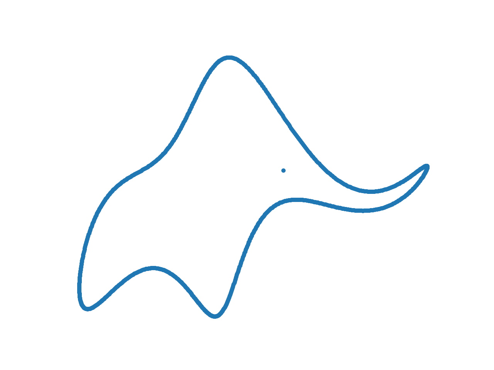
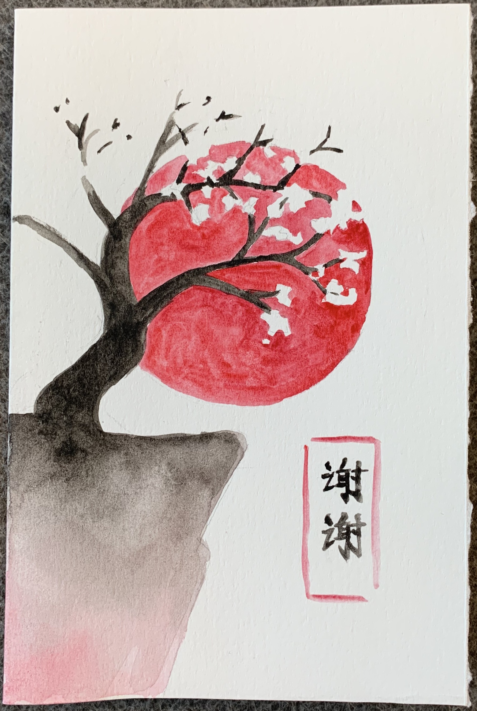
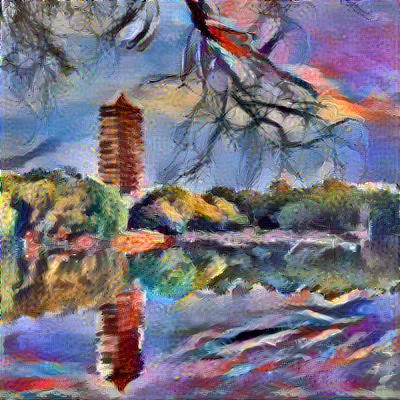
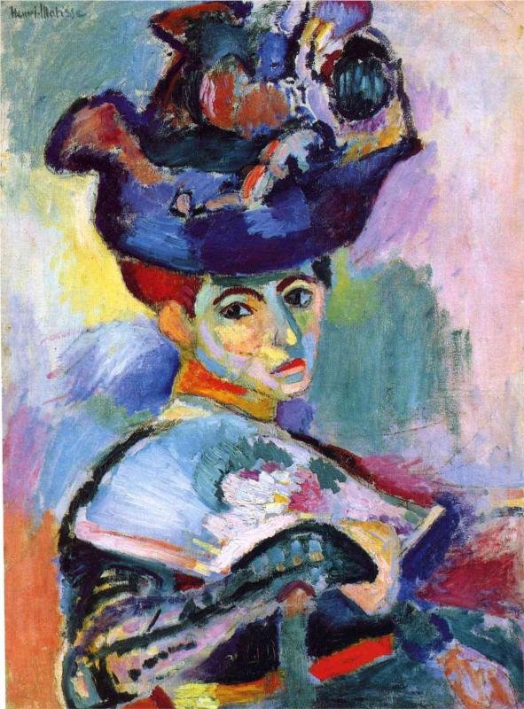
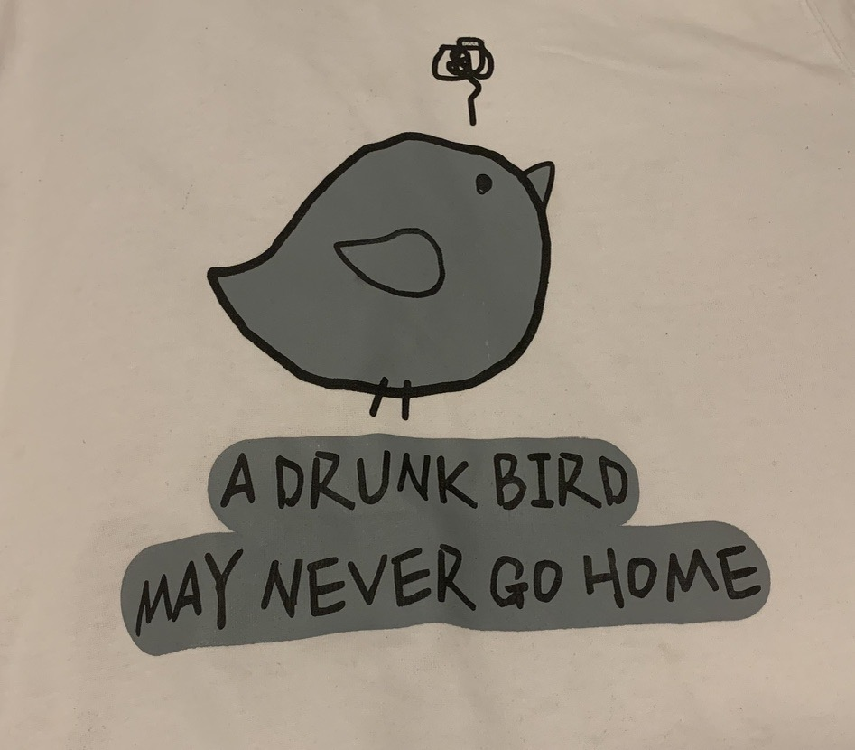

[comment]: <> FF0234(red) FF7902(orange) 1F70CB(blue)

This is a personal website of Ganghua Wang, which is created by [Jekyll](https://jekyllrb.com/) and under construction. 

## Gallery

### *2020*{: .h1s}

{:  width="300px" style='float:left; margin-right: 5%'} 

<blockquote style='float:right'>

With four parameters I can fit an elephant, and with five I can make him wiggle his trunk. 
 <cite style='float:right'>-- John von Neumann</cite>
</blockquote>

[$\leftarrow$ How to fit an elephant like this?]()

### *2019*{: .h1s}

A comic from [PhD comics](http://phdcomics.com/comics/archive.php?comicid=124). 

<!-- {: style="float: right;width:40%;height:40%"} -->
  <figure style="float:right;width:250px;margin-right: 10em;">
  	
  	<figcaption style="text-align: right;">A pic of Ford Hall. </figcaption>
  </figure>
<!-- {: style="float: left;width:49%"} -->

  <figure style="float:left;width:250px;">
  	
  	<figcaption style="text-align: left;">First thanks letter I have ever received. </figcaption>
  </figure>

### *2018*{: .h1s}

Following is a byproduct when we(with Jiaze Qiu and Yixuan Tan) try to reproduce this paper: [Fast Patch-based Style Transfer of Arbitrary Style](https://arxiv.org/pdf/1612.04337.pdf?fbclid=IwAR2xiW2dBBmnARfERb4wcC2wmLIUC9puHrdgLVCKDj5wZO3dqTCnYTfKl6w), which is based on convolutional nerual network.

<figure >

<figcaption style="text-align: left;" >Output. </figcaption></figure>

<figure >

<figcaption style="text-align: left">Original photo of Boya Tower,   Peking University. </figcaption></figure>

<figure  >

<figcaption style="text-align: left;">Style picture. </figcaption></figure>

For the sake of completeness, I attach a pic of Weiming Lake below as well.
<figure  >

<figcaption style="text-align: left;">Weiming Lake, Peking University. </figcaption></figure>

### *2017*{: .h1s}

{:  width="300px" style="float: left; margin-right:5%"} 

<blockquote style='float:right'>

A drunk man will find his way home, but a drunk bird may get lost forever. 
 <cite style='float:right'>-- Shizuo Kakutani</cite>
</blockquote>

The first time I heard this story is from my instructor of *Applied Stochastic Processes*, [Prof. Dayue Chen](http://www.math.pku.edu.cn/teachers/dayue/indexE.htm).

Another example I learnd in this course is that, "Life is a martingale." Though he meant that life is therefore ergodic and don't feel upset when you meet troubles, I still hope it can be a submartingale.

[\\]: <> 
<blockquote > Life is a martingale.</blockquote>

