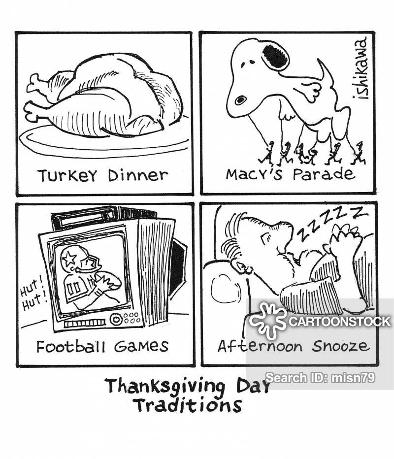

## Lab Information

| Course Number | STAT 3011                                               |
| ------------- | ------------------------------------------------------- |
| Lab Number    | STAT 3011-014,015,016                                   |
| TA            | Ganghua Wang                                            |
| Email         | wang9019@umn.edu                                        |
| Office Hours  | Monday 2:30pm - 3:30pm   Wednesday 2:00pm - 3:50 pm |
| Location      | 495 Ford Hall                                           |

***Writing at the end of semester*:**

Thanks all who came to my lab this semester. I do hope you can learn sth. from my lab, especially how we think about a problem in a statistical way. I also learned a lot from you like how to better communicate with students. Also, it’s my honor to received a thanks letter from one of you. I really appreciate that and it encourages me a lot. Good luck to your final and thank all of you.

*Warning:* This page may be removed or links to materials may be unavailable in the future.

## Schedule

- Week 1, Sept. 3, Introduction to R and RStudio

  [Note](courses/STAT3011/LabHandout_Week1.pdf)
<!--  https://drive.google.com/drive/folders/1bgIScNMDtiZzUpc4ZiE2O_B7dCriv1TR?usp=sharing -->

- Week 2, Sept. 10, Basic R operations, import and explore data

  [Outline](courses/STAT3011/Week2_Lab.pdf), [Code](courses/STAT3011/Week2LabRscript.R)

- Week 3, Sept. 17,  Using R to analyze Cereal Dataset Example

	[Homework 1](courses/STAT3011/HW1_3011_Fall19.pdf) 
	
  [LabHandout](courses/STAT3011/Lab1_3011_Fall2019.pdf), [LabSolution](courses/STAT3011/Lab1Sol_3011_Fall2019.pdf), [LabCode](courses/STAT3011/Lab1_3011_Fall19.R)

- Week 4, Sept. 24,  Using R to analyze Getting to know yourself survey, Part I

	[Homework 2](courses/STAT3011/HW2.pdf) 
	
  [LabHandout](courses/STAT3011/week4lab.pdf), [LabSolution](courses/STAT3011/week4lab_solution.pdf), [LabCode](courses/STAT3011/week4lab.R)

- Week 5, Oct. 1,  Using R to analyze Getting to know yourself survey, Part II

	[Homework 3](courses/STAT3011/HW3.pdf) 
	
  [LabHandout](courses/STAT3011/week5lab.pdf), [Getting To Know You Survey Dataset Details F2019](courses/STAT3011/Getting To Know You Survey Dataset Details F2019.pdf)
  
  [LabSolution](courses/STAT3011/week5lab_solution.pdf), [LabCode](courses/STAT3011/week5lab.R), [Notes for Z-score](courses/STAT3011/notes5.pdf)

- Week 6, Oct. 8,  Simulation Study

  [Homework 4](courses/STAT3011/HW4_3011_Fall19.pdf) 

  [LabHandout](courses/STAT3011/Lab4Handout_3011_Fall19.pdf), [LabSolution](courses/STAT3011/Lab4HandoutSol_3011_Fall19.pdf),  [Population v.s. Sample Notes](courses/STAT3011/Population v.s. Sample.pdf)

- Week 7, Oct. 15,  Review for midterm1.

  [Notes for pnorm, qnorm, Z-score (updated)](courses/STAT3011/notes5.pdf)

- Week 8, Oct. 22,  Simulation study of Confidence Interval.
	
	[Homework 5](courses/STAT3011/stat3011_fall2019_hw5.pdf)  
  
  [LabHandout(pdf)](courses/STAT3011/STAT3011_Fall2019_Week8Lab.pdf), [LabCode(R markdown)](courses/STAT3011/Lab4HandoutSol_3011_Fall19.rmd), [Notes_CI (updated)](courses/STAT3011/notes8.pdf)

- Week 9, Oct. 29, Hypothesis testing for proportion.

	[Homework 6](courses/STAT3011/HW6_3011_Fall19.pdf)   
  
  [LabHandout](courses/STAT3011/LabWeek9.pdf), [LabSolution](courses/STAT3011/LabWeek9Solutions.pdf), [Notes9](courses/STAT3011/Hypothesis testing for proportion.pdf)

- Week 10, Nov. 5, Hypothesis testing for normal distribution.

	[Homework 7](courses/STAT3011/HW7.pdf)   
  
  [LabHandout](courses/STAT3011/LabWeek10.pdf), [LabCode](courses/STAT3011/Lab10Script.R), [LabSolution](courses/STAT3011/LabWeek10Solutions.pdf), [Notes10](courses/STAT3011/Notes10.pdf)

- Week 11, Nov. 12, Useful R commands for practical assignment.

	[Homework 8](courses/STAT3011/HW8_3011_Fall19.pdf)    
  
  [LabHandout](courses/STAT3011/Lab8_3011_Fall19.pdf), [LabSolution](courses/STAT3011/Lab8Solution_3011_Fall19.pdf)

- Week 12, Nov. 19, Review for midterm2.

- Week 13, Nov. 26, ANOVA.

  Happy holiday and enjoy your break :)

  [Homework 9](courses/STAT3011/HW9_3011_F19.pdf)  

	[LabHandout](courses/STAT3011/Lab9_3011_F19.pdf), [LabSolution](courses/STAT3011/Lab9Solution_3011_F19.pdf)

  <i>"Three sd.s cover 99.7% of the data"</i>

- Week 14, Dec. 3, Linear regression.

  [Homework 10](courses/STAT3011/stat3011_fall2019_hw10.pdf), [HW_R_problem_data](courses/STAT3011/STAT3011_HW10_R_problem_data.txt) 

  [LabHandout](courses/STAT3011/STAT3011_Fall2019_Week14Lab.pdf)

- Week 15, Dec. 10, More on linear regression.

  Keep warm!
  
  [LabHandout](courses/STAT3011/Lab10.3011.Spring19.pdf), [LabSolution](courses/STAT3011/Lab10.3011.Spring19.Solution.pdf)
  
  